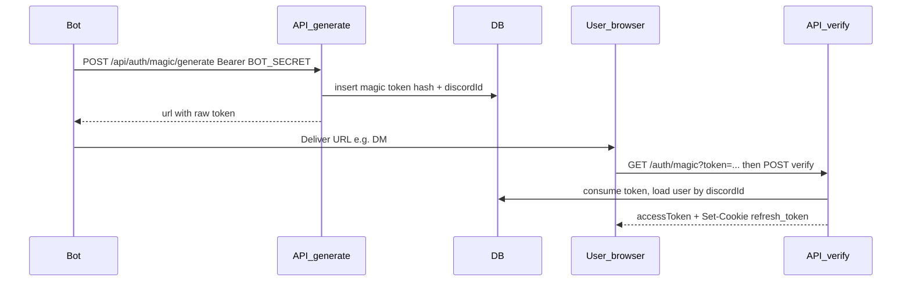

# 332 App

Next.js application with Hono-backed API routes. This document covers **deployment** and **authentication** (passkeys, Discord OAuth, magic links, QR login).

The runnable project lives in the [`app/`](app/) directory.

## Deployment

### Stack

The UI and API are served by **Next.js 16** (`next build` / `next start`). HTTP APIs are implemented with **Hono** and mounted through the Next catch-all route [`app/app/api/[[...route]]/route.ts`](app/app/api/[[...route]]/route.ts) via `hono/vercel`, so the same app runs on **Vercel** or any environment that runs the standard Next.js Node server.

### Prerequisites

- [Node.js](https://nodejs.org/) (version compatible with Next.js 16)
- [pnpm](https://pnpm.io/)

### Local development

From the repository root:

```bash
cd app
pnpm install
cp .env.local.example .env.local
# Edit .env.local with your secrets and URLs (see below)
pnpm dev
```

The dev server uses Turbopack (`next dev --turbopack`).

### Production build

```bash
cd app
pnpm install
pnpm build
pnpm start
```

Set the same environment variables on your host (e.g. Vercel project settings → Environment Variables). There is no `vercel.json` in this repo; use the **Next.js** framework preset. If the Git repository root is above the Next app, set the Vercel **Root Directory** to `app`.

### Environment variables

Copy [`app/.env.local.example`](app/.env.local.example) and fill every value you need. Grouped overview:

| Group | Purpose |
| --- | --- |
| **URLs** | `NEXT_PUBLIC_APP_URL` must be the exact browser origin (scheme, host, port, no trailing slash unless your app expects it). Used for WebAuthn: the passkey **RP ID** is derived from this URL’s **hostname** (`app/server/lib/passkey.ts`). |
| **JWT / crypto** | `JWT_SECRET`, `JWT_REFRESH_SECRET`, `DISCORD_LINK_SECRET` — each must be at least 32 characters. In production, JWT secrets are validated when the server loads (`app/server/lib/jwt.ts`). `BOT_SECRET` protects bot-only endpoints (e.g. magic link generation). `QR_ENCRYPTION_KEY` must be exactly **64 hex characters** (32 bytes) for QR login. |
| **Supabase** | `SUPABASE_URL`, `SUPABASE_SERVICE_ROLE_KEY`, `SUPABASE_ANON_KEY`, `DATABASE_URL` (PostgreSQL URI for schema/migrations). See `app/server/db/`. |
| **Discord OAuth** | `DISCORD_CLIENT_ID`, `DISCORD_CLIENT_SECRET`, `DISCORD_REDIRECT_URI` — the redirect URI must match the URL configured in the [Discord Developer Portal](https://discord.com/developers/applications) (typically `{NEXT_PUBLIC_APP_URL}/api/auth/discord/callback`). |
| **Client** | `NEXT_PUBLIC_SUPABASE_URL`, `NEXT_PUBLIC_SUPABASE_ANON_KEY`, `NEXT_PUBLIC_APP_VERSION` (optional). |
| **Optional R2** | Cloudflare R2 credentials for WebPC disk images — server-only; never expose in client bundles. See comments in `.env.local.example`. |

Use **HTTPS** in production: cookies for refresh tokens use `secure` in production, and passkeys require a trustworthy origin.

### Rate limiting

Some auth routes use an **in-memory** rate limiter (`app/server/middleware/rate-limit.ts`). Limits apply per server instance and client IP (using `x-real-ip` or the first `x-forwarded-for` hop). On serverless platforms, this is **not** a global shared limit across instances.

---

## Authentication

### Session model

All login methods end in the same **session** shape:

- **Access token**: A short-lived JWT sent as `Authorization: Bearer <accessToken>`. Verified with `JWT_SECRET`. The token includes a **session id**; the server checks that the session exists in the database, belongs to the user, and is not expired (`app/server/middleware/auth.ts`). Stolen or forged tokens cannot work without a matching session row.
- **Refresh token**: A longer-lived JWT stored in an **http-only** cookie named `refresh_token`. Use `POST /api/auth/refresh` to rotate the refresh token and obtain a new access token; use `POST /api/auth/logout` to end the session and clear the cookie (`app/server/routes/auth/refresh.ts`).

### Per-method toggles

Each user has flags such as `loginPasskeyEnabled`, `loginDiscordEnabled`, `loginMagicEnabled`, and `loginQrEnabled`. They are returned on `GET /api/me` and enforced in each flow (`app/server/lib/login-methods.ts`). If a method is disabled for that user, the corresponding login path is rejected.

### Passkeys (WebAuthn)

Uses `@simplewebauthn/server` (and the browser package on the client). Registration and authentication options use the **relying party** (`rpID`) and **origin** from `NEXT_PUBLIC_APP_URL`.

| Step | Method | Path |
| --- | --- | --- |
| Start registration (after invite claim) | `POST` | `/api/auth/register/start` |
| Finish registration | `POST` | `/api/auth/register/finish` |
| Login challenge | `POST` | `/api/auth/challenge` |
| Login verify | `POST` | `/api/auth/verify` |
| Add passkey (logged in) | `POST` | `/api/auth/add/start`, `/api/auth/add/finish` |
| List passkeys | `GET` | `/api/auth/passkeys` |

### Discord OAuth

| Flow | Description |
| --- | --- |
| **Login or signup** | `GET /api/auth/discord` — optional `registrationToken` for new users coming from the invite flow. Redirects to Discord; `GET /api/auth/discord/callback` exchanges the code, creates or updates the user, sets the refresh cookie, and redirects to `/auth/callback#token=...` so the SPA can read the access token from the URL fragment (`app/server/routes/auth/discord.ts`). |
| **Link Discord** | `POST /api/auth/discord/link-start` (requires `Authorization: Bearer` access token) returns `{ url }` to open in the browser. OAuth `state` is signed with `BOT_SECRET`. |
| **Unlink** | `POST /api/auth/discord/unlink` — requires another way to sign in (e.g. a passkey) so the account is not locked out. |

### Magic links (bot-issued)

Magic links let a **trusted bot** (or any service that knows `BOT_SECRET`) send a one-time login URL to a user who is identified by **Discord user id** (snowflake string), not by the app’s internal UUID.

#### 1. Mint a link (server-to-server)

Only `POST /api/auth/magic/generate` with header `Authorization: Bearer <BOT_SECRET>` may create a token.

**Request body (JSON):**

- `discordId` (string, required): Discord user snowflake ID.
- `expiresIn` (string, optional): Duration like `"10m"` or `"5m"` (minutes). Parsed as `\d+m`; capped at **30 minutes**.

**Response:** `{ "url": "<NEXT_PUBLIC_APP_URL>/auth/magic?token=..." }`.

The server stores only **SHA-256(token)**; the raw token appears once in the URL. The rate limit on this route is **5 requests per minute per IP** (`MAGIC_LINK_RATE_LIMIT` in `app/server/lib/constants.ts`).

#### 2. Token lifecycle and user lookup

- The row stores `discordId` and, if the user already exists, `userId`.
- On verify, the user must exist, be active, and have **magic login enabled** (`loginMagicEnabled`).
- The token is **single-use** and marked used before tokens are issued (prevents races).

#### 3. Verify (browser)

`POST /api/auth/magic/verify` with JSON `{ "token": "<raw token>", "isPwa": false }` and `credentials: 'include'` so the refresh cookie is set. Success: `{ "accessToken": "..." }` and `Set-Cookie` for `refresh_token`.

**Flow A — open link:** User opens `/auth/magic?token=...` (`app/app/(auth)/auth/magic/page.tsx`). The page auto-calls `/api/auth/magic/verify`.

**Flow B — paste token:** On the login page, Magic Link tab (`app/components/auth/MagicLinkForm.tsx`), the user pastes the raw token; same verify request.

**Errors:** Failures return **401** without distinguishing invalid, expired, or already-used tokens (anti-enumeration).

#### Example: issue a magic link with curl

`discordId` must be the **Discord** user id (e.g. `123456789012345678`), not the app database user UUID.

```bash
curl -sS -X POST "${NEXT_PUBLIC_APP_URL}/api/auth/magic/generate" \
  -H "Authorization: Bearer ${BOT_SECRET}" \
  -H "Content-Type: application/json" \
  -d '{"discordId":"123456789012345678","expiresIn":"10m"}'
```

Example response:

```json
{"url":"https://your-host.example.com/auth/magic?token=..."}
```

#### Sequence (magic link)



### QR code login

QR login lets a **desktop** browser start a session and a **mobile** device (already signed in) approve it. Requires `QR_ENCRYPTION_KEY` and `loginQrEnabled` for the approving user.

| Step | Method | Path |
| --- | --- | --- |
| Create session (desktop) | `POST` | `/api/auth/qr/init` |
| Poll QR URL + status (desktop) | `GET` | `/api/auth/qr/code?sessionId=<uuid>` |
| Scan (mobile, authenticated) | `POST` | `/api/auth/qr/scan` |
| Approve / reject (mobile) | `POST` | `/api/auth/qr/approve`, `/api/auth/qr/reject` |
| Complete login (desktop) | `POST` | `/api/auth/qr/finalize` |

Desktop calls `init`, then polls `code` until it receives a `qrUrl` (rotates about every second). The mobile app scans the QR, calls `scan` with the session id and rolling token, then `approve` or `reject`. When approved, the desktop calls `finalize` with `sessionId` (and optional `isPwa`) to receive tokens and the refresh cookie, same pattern as magic link verify.
